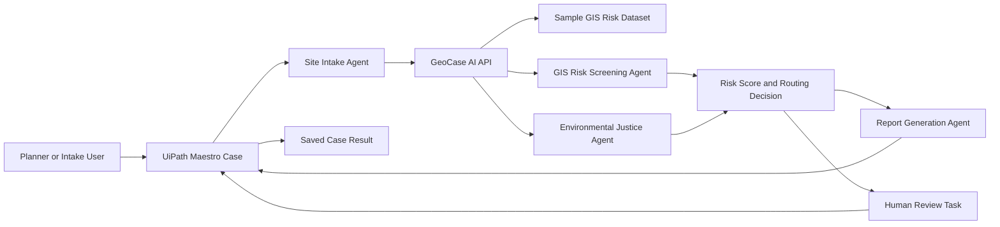

# GeoCase AI Architecture

UiPath coordinates the case lifecycle. The Python service provides GIS-style risk screening, risk explanation, and report content. Medium- and high-risk cases remain human-in-the-loop.
