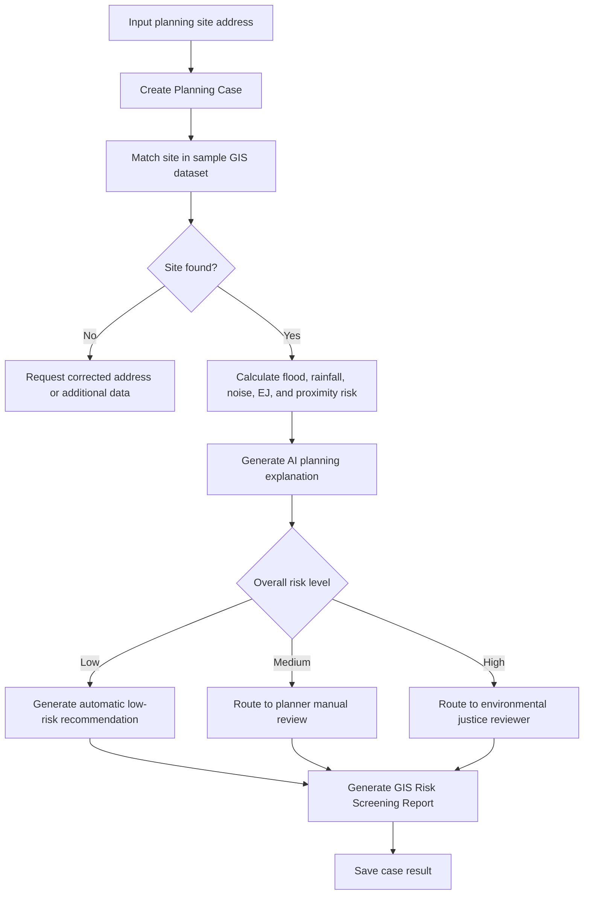

# GeoCase AI Workflow

```mermaid
flowchart TD
    A["Input planning site address"] --> B["Create Planning Case"]
    B --> C["Match site in sample GIS dataset"]
    C --> D{"Site found?"}
    D -- "No" --> E["Request corrected address or additional data"]
    D -- "Yes" --> F["Calculate flood, rainfall, noise, EJ, and proximity risk"]
    F --> G["Generate AI planning explanation"]
    G --> H{"Overall risk level"}
    H -- "Low" --> I["Generate automatic low-risk recommendation"]
    H -- "Medium" --> J["Route to planner manual review"]
    H -- "High" --> K["Route to environmental justice reviewer"]
    I --> L["Generate GIS Risk Screening Report"]
    J --> L
    K --> L
    L --> M["Save case result"]
```
